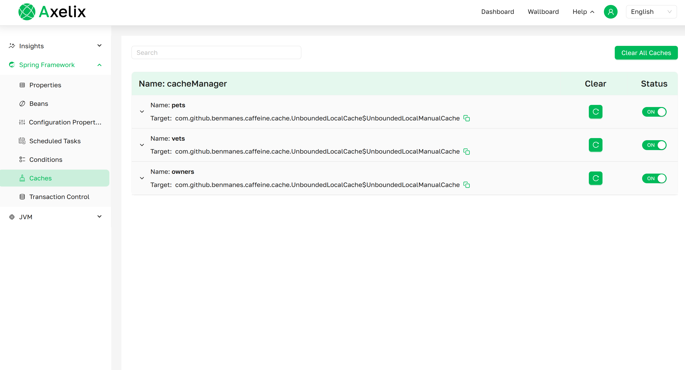
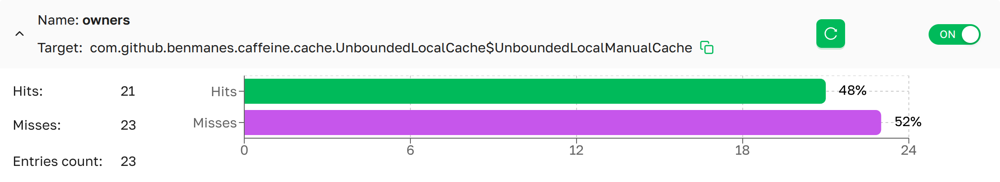

# Caches

The **Caches** page provides access to all configured caches in the Spring Boot application. It displays cache 
metrics such as hits and misses rates, estimated entry size, allows status management, and supports clearing individual 
caches or all caches at once.

***Caches page as presented in Axelix UI***

---

### Caches List
A scrollable list of all configured `Caches` in the application, grouped by their respective `Cache managers`.
- **Clear All caches**:    Button to clear all caches. (See **Interactive Features**)
- **Name**:                The name of the cache manager.

---

### The Cache Details

***Cache page details as presented in Axelix UI***

- **Name**            The name of the cache.
- **Target**          The fully qualified name of the native cache.
- **Hits**            The number of cache hits.
- **Misses**          The number of cache misses.
- **Entries Size**    The estimated number of entries in the cache (Currently, we only support Caffeine Cache and ConcurrentMapCache)
- **Clear**           Clears the cache. (See **Interactive Features**)
- **Status**          Displays the status and allows you to enable or disable a specific cache manually. (See **Interactive Features**)

---

:::note Interactive Features

#### Clear All caches
We provide a convenient way to clear all caches in the application. To do so, click the 

#### Clear cache
To clear an individual cache, click  next to the desired cache.

#### Status
We provide the ability to manage the state of a specific cache. The initial state of each cache is (on) , 
meaning the cache is enabled. To disable it, switch the Status to (off) . 

:::