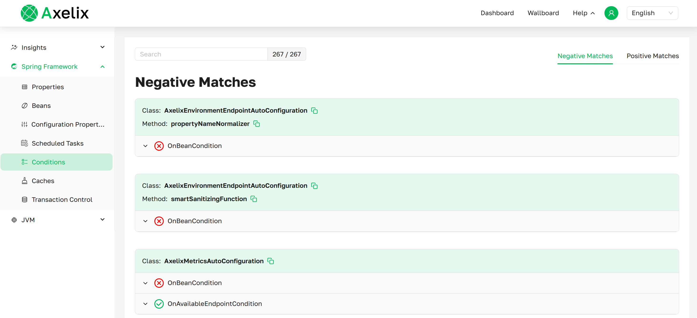
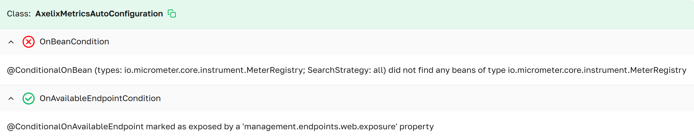
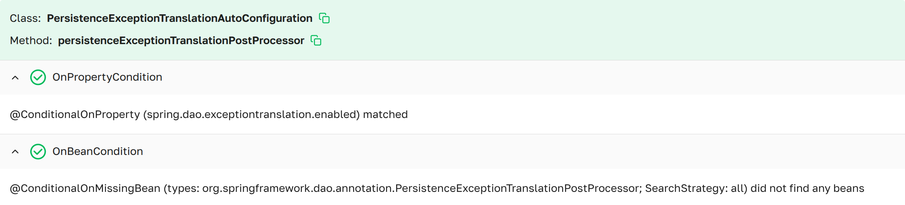

# Conditions

The **Conditions** page provides information about the configured conditions in the Spring Boot application.

***Conditions page as presented in Axelix UI***

---

### TAB: Negative Matches

***Conditions negative matches page as presented in Axelix UI***

A scrollable list displaying all conditions whose requirements do not match.

- **ClassName**    The name of the class annotated with a conditional annotation, or the class that contains it.
- **MethodName**   The name of the method on which the conditional annotation was put.
- **NotMatched**   List of conditions that were not matched.
- **Matched**      List of conditions that were matched.
- **Message**      Descriptive message explaining why the condition matched or did not match.

### TAB: Positive Matches

***Conditions matches page as presented in Axelix UI***

A scrollable list displaying all conditions whose requirements match.

- **ClassName**   The name of the class annotated with a conditional annotation, or the class that contains it.
- **MethodName**  The name of the method on which the conditional annotation was put.
- **Matched**     List of conditions that were evaluated and matched.
- **Message**     Descriptive message explaining why the condition matched.