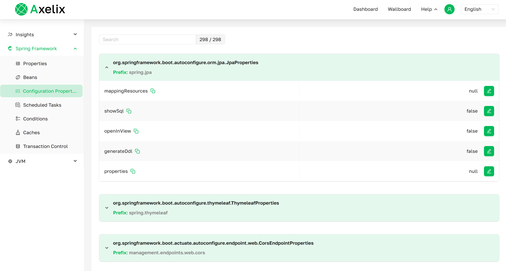
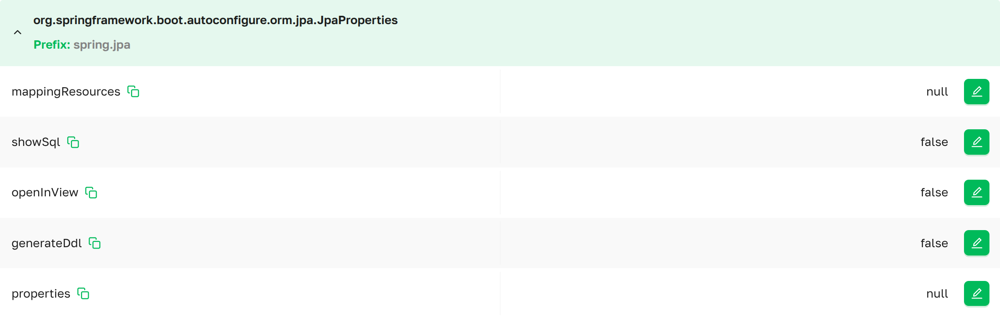

# Configuration Properties

The "Configuration Properties” page provides full visibility into all properties in the Spring Boot application,
that are annotated with `@ConfigurationProperties`.

***Configuration Properties as presented in Axelix UI***

### Configuration Properties List
A scrollable list displaying all active Configuration Properties beans in the application, 
organized with expandable dropdowns (open by default) and a search function for easy navigation, 
plus an active-properties counter.

---

### Configuration Properties Details Dropdown

***Configuration Properties details as presented in Axelix UI***

The dropdown displays the following information:
- **Bean Name**:  This is the class `annotated` with `@ConfigurationProperties`.
- **Prefix**:     This is the properties `prefix` that can be bound to the given **Bean Name**. 
                  It consists of one or more words separated by dots, for example `spring.jpa`.
- **Properties**: Active `properties` that syntactically match the field name within the **Bean Name**,for example `showSql`.
- **Value**:      The property `value` currently used by the Spring Boot application.

:::info
By default, the property value is hidden as `*****`. To enable value visibility, 
you must add the property `management.endpoint.configprops.show-values` with the value `always` 
to the Application properties files.
:::

---

:::note Interactive Features
We provide the ability to change the property value:
1) To do this, click  next to the selected property’s value.
2) After making changes, click the  to cancel the change,
   or the  to confirm the action.
3) After that, a pop-up message `Unexpected server error. Please, re-try request later.` will appear, 
   and further interaction with the service will be unavailable until the Spring Boot application context is fully restarted.

**Here, a GIF should be added to demonstrate the ability to change the property value.**

:::warning
It is important to note that changing the value of any property triggers a restart of the Spring Boot application context,
which may lead to unpredictable consequences, **such as the application failing to start, degraded performance, or impacts on data integrity or security**.
:::