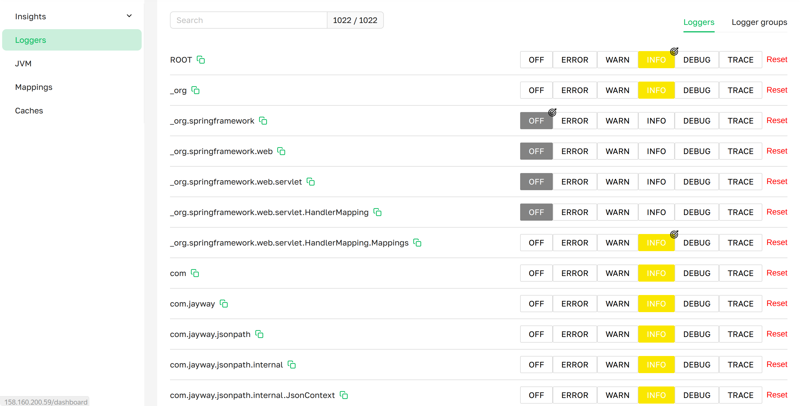
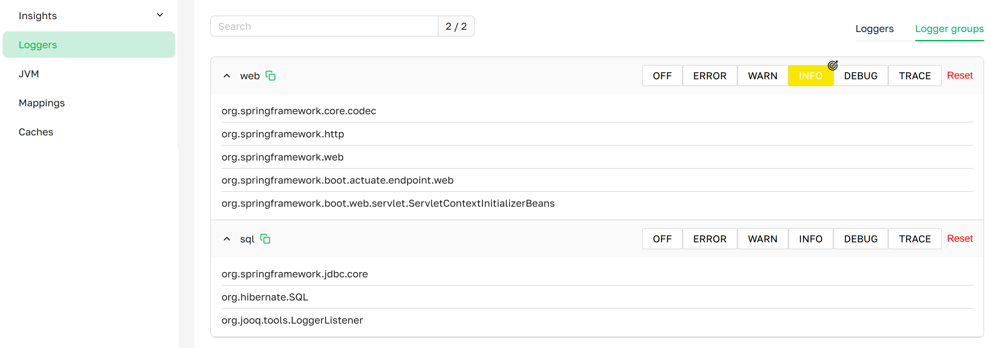

import {LoggersTable} from './LoggersTable';
import {LoggersTableReset} from './LoggersTableReset';
import {TargetThemeIcon} from './TargetThemeIcon';
import { INFO, DEBUG, WARN, TRACE } from './StatePaletteForLoggingLevel';

# Loggers

The **Loggers** page provides access to all configured logging mechanisms in a Spring Boot application, 
logger groups, and allows changing their logging levels.

***Loggers page as presented in Axelix UI***

### Loggers List
A scrollable list displaying all active loggers in the application, with an indicator of their logging levels, 
a search function for easy navigation, and a counter of active loggers.

***Logger groups page as presented in Axelix UI***

### Logger group List
A scrollable list displaying all logger groups, with an indicator of their logging levels, 
a search function for groups and loggers for easy navigation, and a counter of groups.

---

### TAB: Loggers
- **Name**:                 The name of the logger.
- **Logging level**:        The logger's current level. (**Interactive Features**)
- **Reset**                 Resets the logging level to its initial value. (**Interactive Features**)

### TAB: Logger groups
- **Name**:                 The name of the logger group.
- **Logging group level**:  The current logging level of the logger group. If no level is highlighted by a color indicator, 
                            the loggers within the group have different logging levels. (**Interactive Features**)

---

:::note Interactive Features
We provide the ability to change the logging level of an individual logger as well as a logger group.

### Loggers
For example, the logger com.nucleonforge.axelix.sbs has a logging level of <INFO /> (starting point).
To change its level, click on the desired level, for example <WARN />.
The logger will update, and the selected level will be marked with an icon <TargetThemeIcon />.
Note that when changing the logging level of `com.nucleonforge.axelix` from <INFO /> to <DEBUG /> (step 2),
it will also be marked with an icon <TargetThemeIcon />, and all loggers with the prefix `com.nucleonforge.axelix`
will change their level to <DEBUG /> (step 2). However, they will not be marked with an icon <TargetThemeIcon />,
because their level matches the parent logger `com.nucleonforge.axelix`.

<LoggersTable />

We also provide the ability to reset the logging level for a specific logger:
1. Initially, the `com.nucleonforge.axelix.sbs` logger had the <TRACE /> level (starting point).
2. It was then changed to the <INFO /> logging level (step 1).
3. Using the **Reset** button, you can restore the logger to its original <TRACE /> level (step 2).

<LoggersTableReset />

### Logger groups
- It is important to understand that if all loggers belonging to the same group have different logging levels,
  the group will not have a color indicator indicating the logging level.
- When changing the logging level, for example, of the `web` group to <WARN />, all loggers belonging to this group
  will have the <WARN /> logging level.
- Unfortunately, as of today, logger groups do not have the ability to reset the logging level.

:::