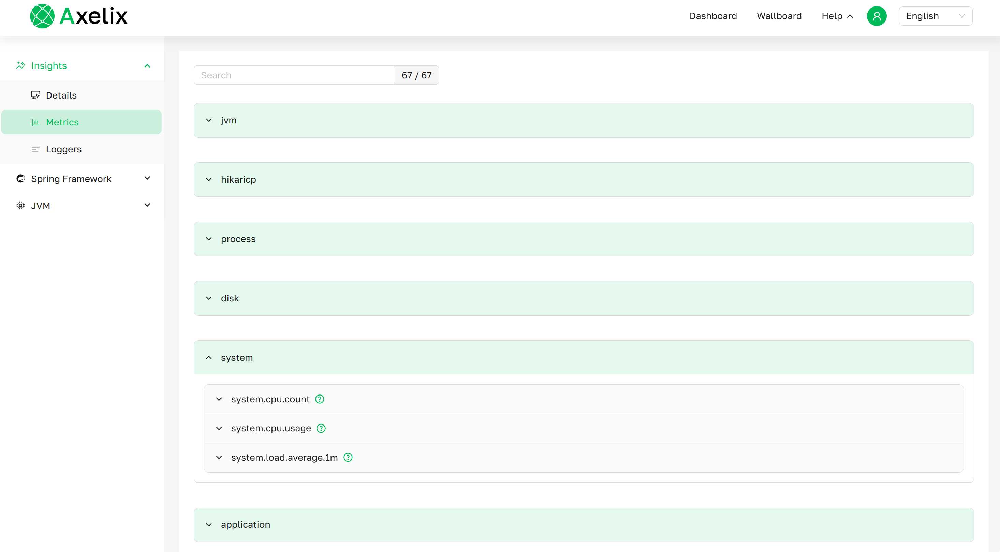
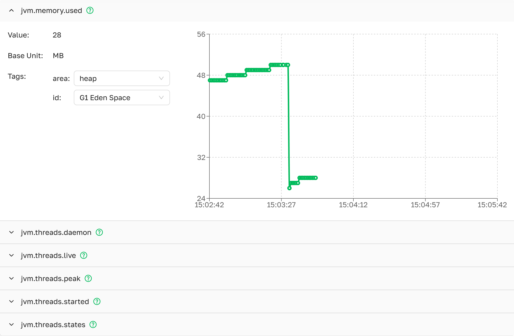

# Metrics

The Metrics page provides comprehensive monitoring and performance insights for your Spring Boot applications.
It displays real-time metrics.

Metrics are automatically grouped by their prefixes into expandable dropdown sections.
Each group represents a logical category of related metrics, such as JVM,
HTTP, or JDBC. This organization helps you quickly find and analyze metrics that belong
to the same functional area.


***Metrics as presented in Axile UI***

---

# Metric Details

The Metric Details page provides in-depth analysis of individual metrics with interactive charts, real-time values,
and intelligent tag filtering capabilities.


***JVM Memory Metric details as presented in Axile UI***

## Page Layout

### **Dropdown Header**
- **Metric Name**: Full metric identifier (e.g., `jvm.memory.max`)
- **Description**: Hover your cursor over the icon 
  to see what this metric measures.

### **Left Panel: Current Metric Information**
Displays real-time information about the selected metric:
- **Value**: Latest measurement
- **Base Unit**: Measurement unit (bytes, milliseconds, percentage, scalar quantity etc.)
- **Tag Combinations**: Dropdown selectors for filtering metrics by tags

### **Right Panel: Time Series Chart**
Shows the metric value changes over time:
- Simple line chart displaying metric values vs. time

---

## Intelligent Tag Filtering (Drilling Down Mechanism)

[**Official Spring Boot documentation: Drilling Down**](https://docs.spring.io/spring-boot/api/rest/actuator/metrics.html)

### **How It Works**
The tag filtering system uses **valid tag combinations** to ensure you only select meaningful dimension combinations.
When you select a tag value, the system automatically updates available options for other tags based 
on architectural constraints.

### **Example: JVM Memory Metrics**
For metric `jvm.memory.used` with tags `area` and `id`:

**Valid Tag Combinations:**
```yaml
# Architectural constraints prevent invalid combinations
Valid:
  - area: heap, id: G1 Eden Space                     ✓
  - area: heap, id: G1 Survivor Space                 ✓
  - area: heap, id: G1 Old Gen                        ✓
  - area: nonheap, id: Metaspace                      ✓
  - area: nonheap, id: Compressed Class Space         ✓
  - area: nonheap, id: CodeHeap profiled nmethods     ✓
  - area: nonheap, id: CodeHeap non-nmethods          ✓
  - area: nonheap, id: CodeHeap nonprofiled-nmethods  ✓

Invalid (not offered):
  - area: heap, id: Metaspace      ✗ # Architecture violation
  - area: nonheap, id: G1 Old Gen  ✗ # Architecture violation
  - etc:
```