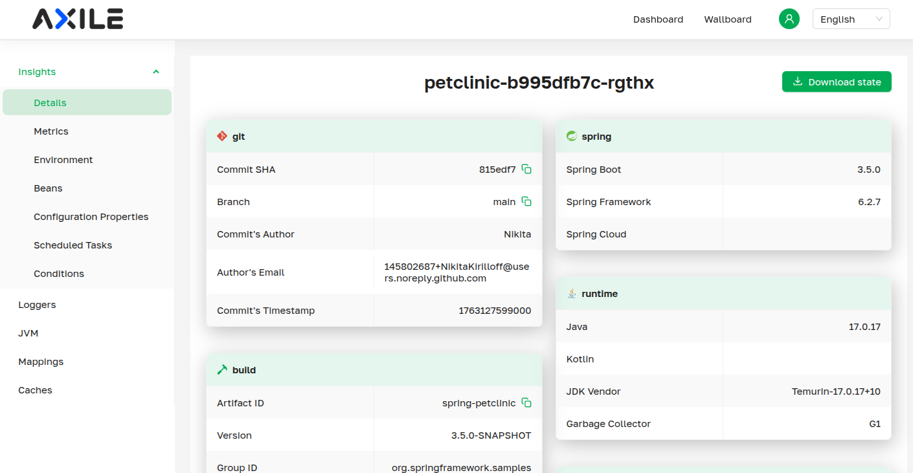
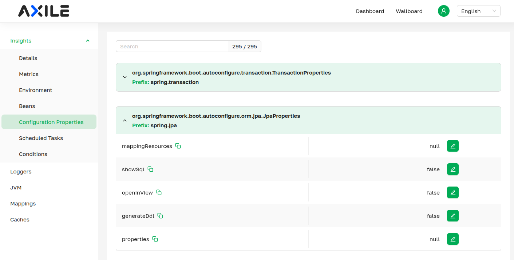

= Axile Architecture

This page outlines the overall architecture of the Axile Project. It explains the constitute parts of Axile, how they work and interact with each other and why they do it this way.

== Part 1. Overall Architecture. Axile Master.

The overall architecture of Axile is intentionally kept quite simple. In fact, you'd be surprised how easy it is to get started and to install it into your environment.

IMPORTANT: This exact page of the documentation intentionally lefts out the details that cover the authentication between the Axile components. That topic xref:security.adoc[has a separate page on its own].

So, let's start from the start. By design, most of the developers will interact with Axile through the UI. Here is the example how it would look like:

.Spring Petclinic as presented in Axile UI

Now, this UI is served from the first component of the Axile - the '*_Axile Master_' (or just '_Master_')*. This component can be considered as the heart of Axile project. Indeed, this is an entrypoint of Axile that, among other things:

- Serves the UI as seen above
- It also processes all the requests from the UI, more in that later
- It is responsible to interact with various external resources/APIs such as kube-apiserver when deployed in K8S environments for example and much more

So, although _Master_ is the entrypoint into the Axile, it does not do a lot of work by itself. For example, in the UI we can find quite a lot of useful information about the state of the given Spring Boot application, for instance,  `@ConfigurationProperties` beans that are available in the application, their bound values etc.:

.Configuration Properties available in Spring Petclinic

Now, all this information is actually provided by a particular Spring Boot application. In our case, it is the https://github.com/spring-projects/spring-petclinic/[Spring Petclinic]. What it means is that the _Axile Master_ queries the particular application that it manages.

TIP: When we say that Axile Master "manages" the particular application, it simply means that Axile Master is, first of all, aware about this service, and, secondly, Axile Master is sure that this service is capable to provide all the necessary APIs

So, the general workflow looks like this:

[#axile_master_as_proxy]
[plantuml, component-structure, svg]
....
@startuml
left to right direction
component [Browser]
component [Axile Master]
component [Spring Boot Application]

[Browser] --> [Axile Master] : HTTP request
[Axile Master] --> [Spring Boot Application] : proxies HTTP request
[Spring Boot Application] --> [Axile Master] : sends response
[Axile Master] --> [Browser] : sends response

@enduml
....

So, rather simple, right?

1. The browser queries the Axile Master
2. The Axile Master

Of course, the internals may be a bit more complicated, as we say, *devil is in the details*. The Master actually does a lot more than just proxying requests to the services it manages. However, for simplicity, stripping out the details this picture above is generally accurate.

== Part 2. Managed Service

The service that Axile Master manages is called "_managed service_", unsurprisingly. So, the managed service responds to the requests received from the Master. The requests that Master sends to the managed service are HTTP requests.

Now, Spring Boot has the Actuator project, that is designed to provide some insights about running Spring Boot application. While Spring Boot Actuator is by itself a great project, in order to provide information that we deemed useful, using only the Spring Boot Actuator endpoints is just not enough. So,